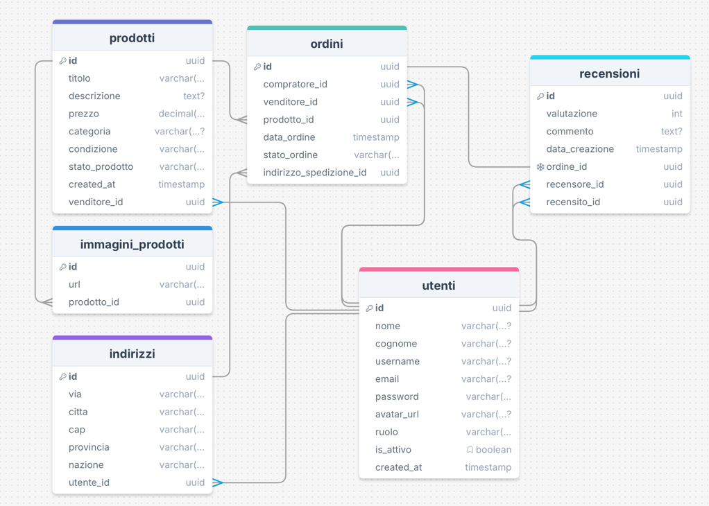

# StreetSell

StreetSell è una web application pensata per facilitare l'incontro tra acquirenti e venditori. La piattaforma permette a
ogni utente di pubblicare i propri annunci e di acquistare articoli da altri utenti in modo semplice e diretto.

---

## Funzionalità Principali

Le seguenti funzionalità sono state implementate in questa fase iniziale del progetto:

### Funzioni di Vendita

* **Pubblicazione Annunci:** Gli utenti possono creare nuovi annunci per gli articoli che desiderano mettere in vendita.
* **Gestione Immagini:** Ogni annuncio supporta l'inclusione di una o più immagini del prodotto caricabili dall'utente.

### Funzioni di Acquisto

* **Acquisto Semplificato:** È possibile effettuare un acquisto, simulando la transazione. Nota: Attualmente, non è
  integrato alcun sistema di pagamento reale.

---

